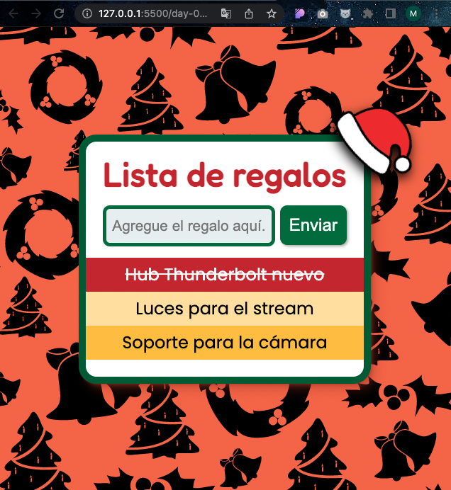
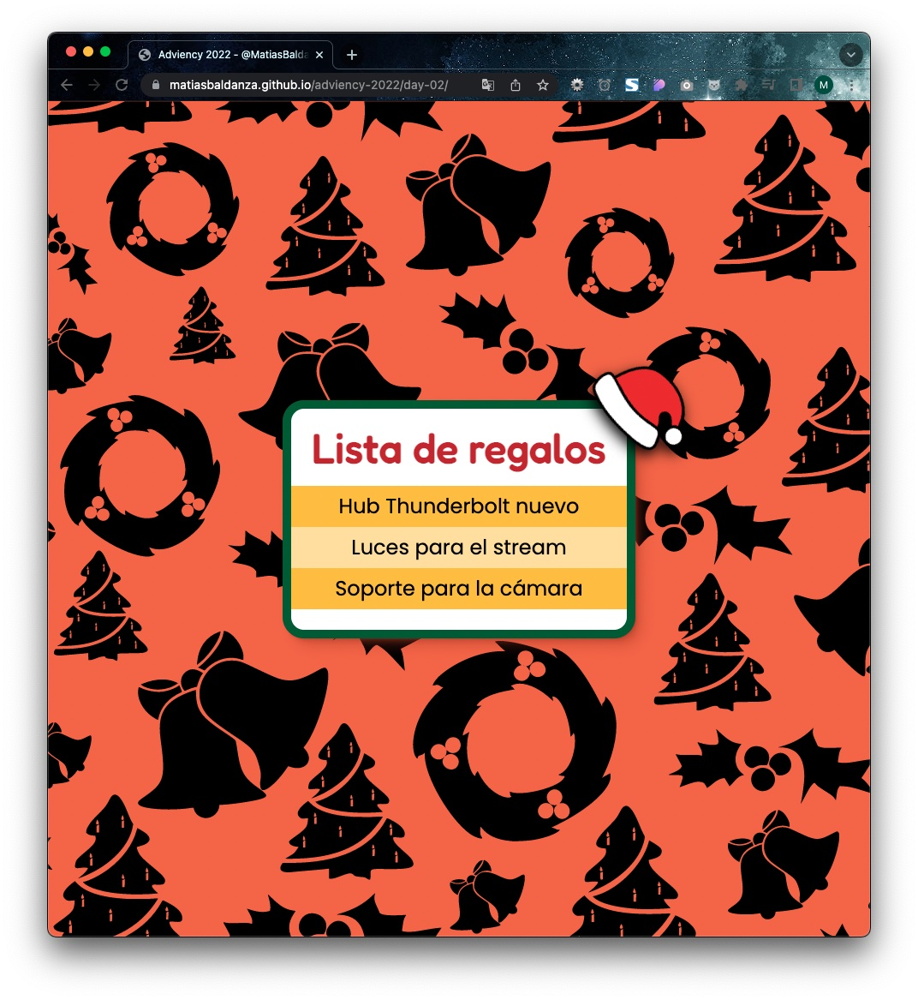
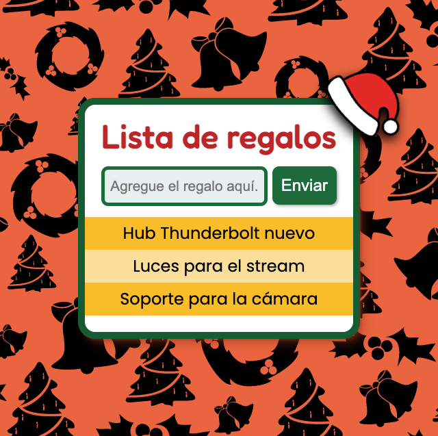
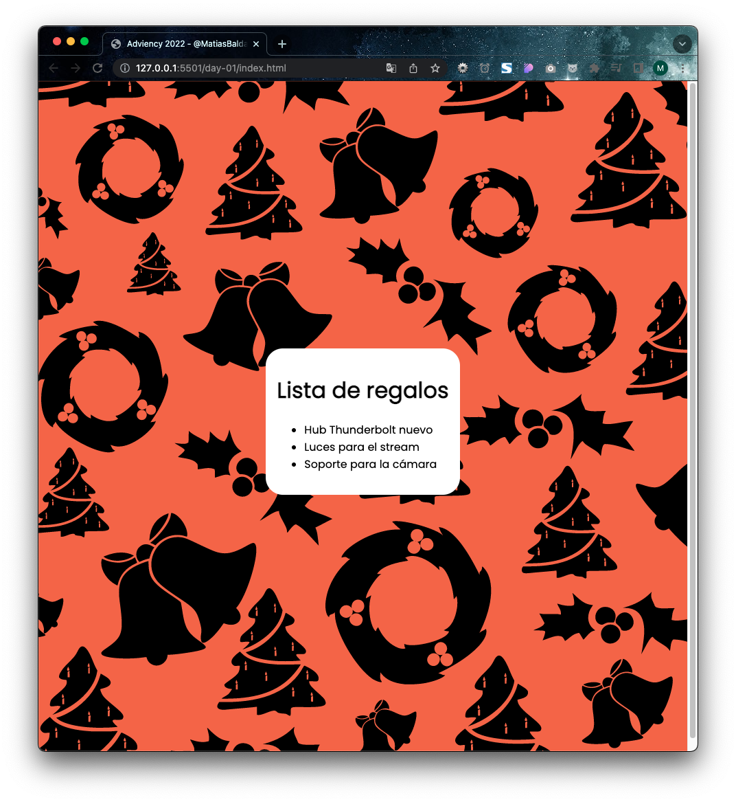

# Calendario de Adviency

Calendario de adviento para desarrollar una web app en 24 días, propuesta por [@Goncy Pozzo](https://twitter.com/goncy).

[Hilo original en Twitter](https://twitter.com/goncy/status/1597581725382721538)

Todos los días se hicieron en vivo en mi [stream](https://twitch.tv/matiasbaldanza):

## Día 4 (2022.12.15)

- [Instrucciones del día 4](https://twitter.com/goncy/status/1599398388562214912)
- [Link al código en el repo](https://github.com/matiasbaldanza/adviency-2022/tree/main/day-04)
- [Link al sitio en vivo](https://matiasbaldanza.github.io/adviency-2022/day-04/)

Actualizamos el día 3 para agregar una animación cada vez que se agrega un elemento a la lista.

Hice trampa? Para el día 4 había que agregar un botón a cada elemento para eliminarlo. Lo que hice fue un poco distinto: Cambié el estado hover de los elementos de la lista para que indiquen que al hacer clic se eliminaría el elemento.

Los elementos se eliminan de la página y del almacenamiento, que por ahora sigue siendo un simple array.

También discutimos cambiar de usar Document a usar DocumentFragment pero no lo utilizamos por no mejorar la performance al agregar elementos uno a uno. Posiblemente lo utilicemos cuando haya que paginar muchos elementos o eliminar varios a la vez.

## Día 3 (2022.12.14)

- [Instrucciones del día 3](https://twitter.com/goncy/status/1599041110164508672)
- [Link al código en el repo](https://github.com/matiasbaldanza/adviency-2022/tree/main/day-03)
- [Link al sitio en vivo](https://matiasbaldanza.github.io/adviency-2022/day-03/)

Implementamos la lista con Javascript (almacenada localmente en un array, por ahora).
Agregamos eventos para agregar nuevos elementos a la lista (mostrándolos y agregándolos al array).
Si se intenta agregar un elemento vacío, hace una animación de "shake" y no carga el elemento vacío.

## Día 2 (2022.12.12)

- [Instrucciones del día 2](https://twitter.com/goncy/status/1598688587154849792)
- [Link al código en el repo](https://github.com/matiasbaldanza/adviency-2022/tree/main/day-02)
- [Link al sitio en vivo](https://matiasbaldanza.github.io/adviency-2022/day-02/)

## Día 1 (2022.12.08)

- [Instrucciones del día 1](https://twitter.com/goncy/status/1597581740746637314)
- [Link al código en el repo](https://github.com/matiasbaldanza/adviency-2022/tree/main/day-01)
- [Link al sitio en vivo](https://matiasbaldanza.github.io/adviency-2022/day-01/)

Lista estática implementada en flexbox. Me adelanté y comencé a ponerle estilos. :-)
